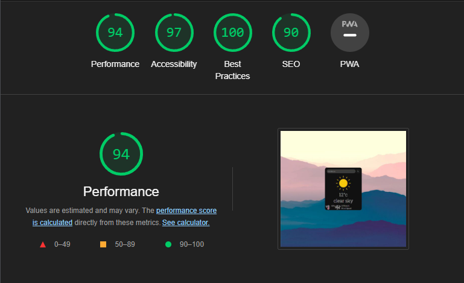

# Simply Weather

Simply Weather, is a mainly JS built app, with the focus of bringing you quick information about the current weather condition. 

## Features

### Existing Features

- __Main Weather App__

  - Avaliable on the only page, and provides quick information about the current weather in the selected city or country of choosing. 

  [Main App](docs/main-app.png)

### Features Left to Implement

- I would have liked to have a list of weather forecasts underneath the main app
- A simple header 
- Humidity text 

## Testing

I have tested the site in the following browsers; Chrome, Microsoft Edge, it worked the same in both browsers.

I confrimed that my app is responsive via the devtools in Chrome, I also tested the app on my phone.

The testing of the API calling was a extremely exhausting process, but eventually I managed to figure it out.

### Validator Testing

- HTML
  - No errors were returned when passing through the official W3C validator
- CSS
  - No errors were found when passing through the official (Jigsaw) validator
- JSHint
  - The JS Code passed though JSHint with no issues, but gave me a few warnings about things I could do better.
- Accessibility

## Deployment

- The site was deployed to GitHub pages. The steps to deploy are as follows:
  - In the GitHub repository, navigate to the Settings tab
  - From the source section drop-down menu, select the Master Branch
  - Once the master branch has been selected, the page will be automatically refreshed with a detailed ribbon display to indicate the successful deployment.

The live link can be found here - <>

## Credits

- I want to thank the guidance of [Easy Tutorials](https://www.youtube.com/watch?v=MIYQR-Ybrn4) taking me step by step through the process of implementing and making a weather app.
I used W3Schools to solve the ever growing riddle of how i wanted call and impliment a API into Javascript.

### Content

- API calling was researched deeply in [W3schools](https://www.w3schools.com) and [Stack-Overflow](https://stackoverflow.com) I would be extremely lost without these resources
- The icon in the search button was taken from [Font Awesome](https://fontawesome.com/)
- I used templates from Code Institute to construct this project
- The images used in the App was taken from [flaticon](https://www.flaticon.com/free-icons/weather)

### Media

- The wallpaper that is used in the background is from a place called [wallpapercave](https://wallpapercave.com) and they provide some sublime wallpapers to use for your desktop